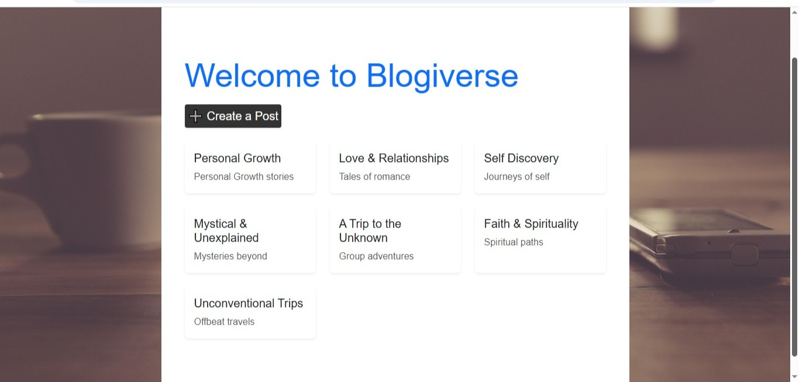
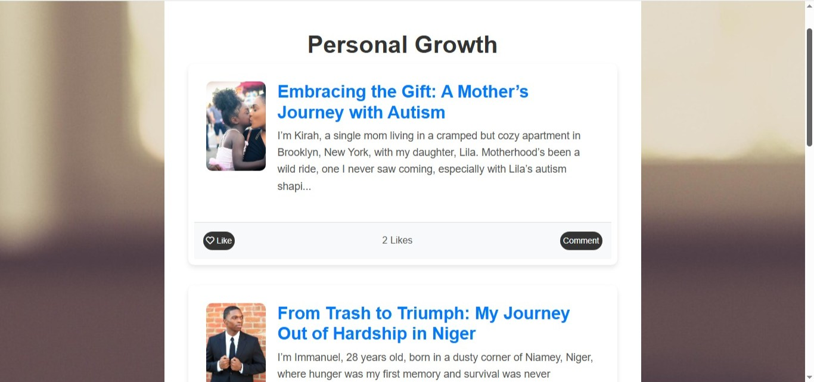
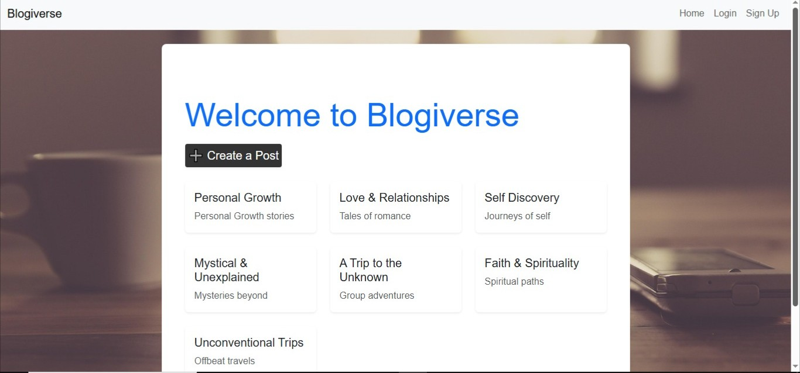
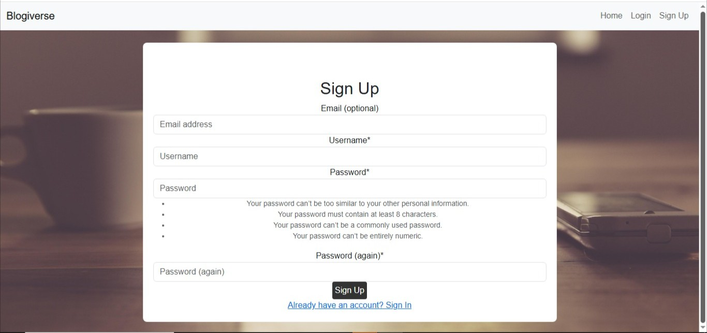
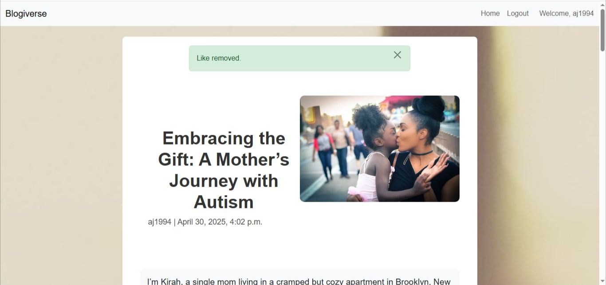

# **Blogiverse**

[](https://github.com/TranshumanistAJ/blogiverse/commits/main)
[](https://github.com/TranshumanistAJ/blogiverse/commits/main)
[](https://github.com/TranshumanistAJ/blogiverse)

## **Overview**
Blogiverse is a vibrant, community-driven blogging platform designed to inspire and connect individuals through storytelling. This Django-powered web application provides a secure, intuitive space where users can create, share, and engage with personal narratives across seven distinct themed forums.

The platform empowers writers, dreamers, and curious readers to express their unique experiences while fostering meaningful connections through likes, comments, and rich multimedia content. Whether you're sharing personal growth journeys, mystical experiences, or unconventional adventures, Blogiverse offers the tools and community to bring your stories to life.

[Click here to visit the live site](https://blogiverse-a5563d05b65c.herokuapp.com)



## **Table of Contents**
* [**Blogiverse**](#blogiverse)
  * [**Overview**](#overview)
  * [**Table of Contents**](#table-of-contents)
  * [**How to Use Blogiverse:**](#how-to-use-blogiverse)
    * [***Getting Started (Registration & Login):***](#getting-started-registration--login)
    * [***Creating Your First Post:***](#creating-your-first-post)
    * [***Engaging with the Community:***](#engaging-with-the-community)
    * [***Managing Your Content:***](#managing-your-content)
* [**Planning Phase:**](#planning-phase)
  * [***User Stories:***](#user-stories)
  * [***Site Aims:***](#site-aims)
  * [***How This Will Be Achieved:***](#how-this-will-be-achieved)
  * [***Target Audience:***](#target-audience)
* [**Features**](#features)
  * [**Homepage & Navigation:**](#homepage--navigation)
    * [**Forum Categories:**](#forum-categories)
    * [**Responsive Navigation:**](#responsive-navigation)
  * [**User Authentication System:**](#user-authentication-system)
    * [**Registration Process (With Validation):**](#registration-process-with-validation)
    * [**Secure Login System:**](#secure-login-system)
    * [**Password Recovery:**](#password-recovery)
  * [**Content Creation & Management:**](#content-creation--management)
    * [**Rich Text Post Creation:**](#rich-text-post-creation)
    * [**Image Upload & Embedding:**](#image-upload--embedding)
    * [**Forum Categorization:**](#forum-categorization)
    * [**Content Editing:**](#content-editing)
    * [**Content Deletion:**](#content-deletion)
  * [**Community Engagement Features:**](#community-engagement-features)
    * [**Like System:**](#like-system)
    * [**Comment System:**](#comment-system)
    * [**Engagement Metrics:**](#engagement-metrics)
  * [**Error Handling & User Feedback:**](#error-handling--user-feedback)
    * [***Form Validation:***](#form-validation)
    * [***Success Messages:***](#success-messages)
    * [***Error Messages:***](#error-messages)
  * [**Security Features:**](#security-features)
  * [**Future Enhancements**](#future-enhancements)
    * [***Social Media Integration:***](#social-media-integration)
    * [***Enhanced User Profiles:***](#enhanced-user-profiles)
    * [***Advanced Search & Discovery:***](#advanced-search--discovery)
    * [***Tagging System:***](#tagging-system)
    * [***Analytics Dashboard:***](#analytics-dashboard)
    * [***Enhanced Communication:***](#enhanced-communication)
* [**Design & User Experience**](#design--user-experience)
  * [**Design Philosophy:**](#design-philosophy)
  * [**Colour Scheme:**](#colour-scheme)
  * [**Typography:**](#typography)
  * [**Wireframes:**](#wireframes)
* [**Data Model & Architecture**](#data-model--architecture)
  * [**Overview of Models:**](#overview-of-models)
  * [**Database Schema:**](#database-schema)
  * [**Application Logic Flow:**](#application-logic-flow)
    * [***User Registration & Authentication Flow:***](#user-registration--authentication-flow)
    * [***Content Creation & Management Flow:***](#content-creation--management-flow)
    * [***Community Engagement Flow:***](#community-engagement-flow)
* [**Testing Phase**](#testing-phase)
* [**Technologies Used**](#technologies-used)
    * [***Languages:***](#languages)
    * [***Frameworks & Libraries:***](#frameworks--libraries)
    * [***Tools & Programs:***](#tools--programs)
    * [***Database:***](#database)
* [**Deployment**](#deployment)
  * [***Local Development Setup:***](#local-development-setup)
  * [***Production Deployment to Heroku:***](#production-deployment-to-heroku)
* [**Credits & Acknowledgements**](#credits--acknowledgements)

## **How to Use Blogiverse:**

### ***Getting Started (Registration & Login):***

Begin your journey by creating a secure account using our streamlined registration process. Simply provide a username, email, and password to join the community.

Returning users can access their accounts through the secure login system, with password recovery available via email for forgotten credentials.

### ***Creating Your First Post:***

Once authenticated, navigate to the "Create Post" section where you can craft your story using our rich text editor. Choose from seven themed forums, add compelling images, and format your content to create engaging narratives that resonate with the community.

### ***Engaging with the Community:***

Discover stories that inspire you by browsing different forums. Show appreciation through the like system and contribute to meaningful discussions through comments. Your engagement helps build a supportive community environment.

### ***Managing Your Content:***

Maintain full control over your published content with comprehensive editing and deletion capabilities. Update your posts as your stories evolve or remove content you no longer wish to share.

# **Planning Phase:**

## ***User Stories:***

### **New Site Users:**
* As a new site user, I want to browse blog posts by forum so that I can find stories that resonate with my interests.
* As a new site user, I want to view detailed posts with images so that I can immerse myself in the narrative visually and emotionally.
* As a new site user, I want to see like and comment counts so that I can identify popular or engaging content.
* As a new site user, I want to sign up with a simple process so that I can quickly join the community and participate.
* As a new site user, I want to recover my account via password reset so that I can regain access if I forget my credentials.

### **Returning Site Users:**
* As a returning site user, I want to create blog posts with text and images so that I can share my personal stories.
* As a returning site user, I want to edit my posts so that I can improve or update my content over time.
* As a returning site user, I want to delete my posts so that I can remove content I no longer wish to share.
* As a returning site user, I want to like other users' posts so that I can express appreciation and support.
* As a returning site user, I want to comment on posts so that I can engage in meaningful discussions with the community.

### **Site Admin:**
* As a site admin, I want to manage forums so that I can organize content effectively.
* As a site admin, I want to view all posts and their engagement metrics so that I can monitor community activity.
* As a site admin, I want to ensure secure authentication so that user data remains protected.

## ***Site Aims:***
The site aims to:
1. Create a safe space where users feel comfortable sharing personal experiences and authentic stories.
2. Foster meaningful community connections through engagement features and shared storytelling experiences.
3. Organize content effectively using themed forums for easy discovery and navigation.
4. Ensure robust security and data protection through modern authentication systems.
5. Provide an intuitive, responsive user experience that works seamlessly across all devices.
6. Support rich content creation with multimedia capabilities and professional formatting tools.

## ***How This Will Be Achieved:***
To achieve the above aims, the site will:
1. Implement Django-allauth for comprehensive user authentication with email verification and password recovery.
2. Create seven distinct themed forums to categorize and organize diverse storytelling content.
3. Integrate Summernote rich text editor for enhanced content creation with image uploads and formatting.
4. Develop comprehensive like and comment systems to facilitate community engagement and feedback.
5. Utilize Bootstrap framework to ensure responsive design and accessibility across all devices.
6. Provide complete CRUD functionality allowing users full control over their content lifecycle.
7. Implement robust error handling and user feedback systems for optimal user experience.

## ***Target Audience:***
Blogiverse targets a diverse community including:
* **Aspiring Writers** seeking a supportive platform to develop and share their storytelling skills.
* **Curious Readers** eager to discover authentic, personal narratives across various life experiences.
* **Community Seekers** who value meaningful interaction through feedback, comments, and engagement.
* **Spiritual Explorers** interested in mystical experiences, faith journeys, and unconventional life paths.
* **Personal Growth Enthusiasts** focused on self-improvement, relationships, and life transformation.

# **Features**

## **Homepage & Navigation:**

### **Forum Categories:**
The homepage presents users with seven distinct themed forums, each designed to host specific types of personal narratives:



**Available Forums:**
* **Personal Growth** - Stories of self-improvement and life transformation
* **Love & Relationships** - Narratives about connections, romance, and human bonds
* **Self Discovery** - Journeys of understanding oneself and finding purpose
* **Mystical & Unexplained** - Experiences beyond conventional understanding
* **A Trip to the Unknown** - Adventures into uncharted territories
* **Faith & Spirituality** - Religious and spiritual journey narratives
* **Unconventional Trips** - Unique travel and life experiences

### **Responsive Navigation:**
The navigation system provides intuitive access to all platform features with clear visual hierarchy and mobile-optimized design.



## **User Authentication System:**

### **Registration Process (With Validation):**
New users can create accounts through a streamlined registration process featuring comprehensive validation:



**Registration Features:**
* Username uniqueness validation
* Email format verification
* Password strength requirements
* Immediate feedback on validation errors
* Automatic redirect to login upon successful registration

### **Secure Login System:**
Returning users access their accounts through a secure login interface:


**Login Features:**
* Session-based authentication
* Remember me functionality
* Clear error messaging for invalid credentials
* Secure password handling
* Automatic redirection to intended destination

### **Password Recovery:**
Users can recover forgotten passwords through email-based reset system:
* Email verification for password reset requests
* Secure token-based reset links
* Password strength validation during reset
* Clear instructions and user feedback

## **Content Creation & Management:**

### **Rich Text Post Creation:**
Authenticated users can create compelling blog posts using an intuitive interface:


**Creation Features:**
* Summernote rich text editor integration
* Real-time content preview
* Forum category selection
* Image upload and embedding capabilities
* Auto-save functionality (planned enhancement)

### **Image Upload & Embedding:**
The platform supports multimedia storytelling through:
* Direct image uploads during post creation
* Automatic image optimization and resizing
* Multiple image support per post
* Alt-text capabilities for accessibility

### **Forum Categorization:**
Content organization through themed forums:
* Mandatory forum selection during post creation
* Clear forum descriptions and guidelines
* Easy forum browsing and filtering
* Administrative forum management capabilities

### **Content Editing:**
Post authors maintain full control over their content:
* Complete post editing capabilities
* Forum recategorization options
* Image replacement and removal
* Content versioning (planned enhancement)

### **Content Deletion:**
Users can remove their content with appropriate safeguards:
* Confirmation dialogs for deletion actions
* Permanent removal of associated images
* Database cleanup and referential integrity
* Soft delete options (planned enhancement)

## **Community Engagement Features:**

### **Like System:**
Express appreciation for posts through an intuitive like system:


**Like Features:**
* One-click like/unlike functionality
* Real-time like count updates
* Visual feedback for user interactions
* Like status persistence across sessions

Users can easily remove their likes:



### **Comment System:**
Engage in meaningful discussions through comprehensive commenting:


**Comment Features:**
* Rich text comment creation
* Author attribution and timestamps
* Comment moderation capabilities
* Nested commenting (planned enhancement)

### **Engagement Metrics:**
Clear display of community interaction:
* Like counts prominently displayed
* Comment counts for each post
* Most popular content highlighting
* User engagement statistics (planned enhancement)

## **Error Handling & User Feedback:**

### ***Form Validation:***
Comprehensive validation across all user inputs:
* Real-time form field validation
* Clear error message display
* Prevention of invalid data submission
* User-friendly error descriptions

### ***Success Messages:***
Immediate confirmation of successful actions:
* Post creation confirmation
* Account registration success
* Login status notifications
* Content update confirmations

### ***Error Messages:***
Clear, helpful error messaging:
* Authentication failure notifications
* Validation error explanations
* System error graceful handling
* Recovery action suggestions

## **Security Features:**
Robust security implementation throughout the platform:
* **CSRF Protection** - Django's built-in CSRF middleware preventing cross-site request forgery
* **User Authorization** - Proper permission checks ensuring users can only modify their own content
* **SQL Injection Prevention** - ORM-based database queries preventing malicious SQL injection
* **Secure Password Handling** - Django's built-in password encryption and validation
* **Session Security** - Secure session management with appropriate timeouts
* **Input Sanitization** - Comprehensive cleaning of user inputs before database storage

## **Future Enhancements**

### ***Social Media Integration:***
* **Share Buttons** - Easy sharing to Twitter, Facebook, LinkedIn
* **Social Login** - Authentication via Google, Facebook, GitHub  
* **Cross-Platform Promotion** - Automated sharing options for new posts
* **Social Media Preview Cards** - Rich preview cards when sharing externally

### ***Enhanced User Profiles:***
* **Personal Bio** - Detailed user information and writing background
* **Post Portfolio** - Showcase of user's published content with statistics
* **Achievement Badges** - Recognition system for community contributions
* **Follow System** - Subscribe to favorite authors for content updates
* **User Statistics** - Writing analytics and engagement metrics

### ***Advanced Search & Discovery:***
* **Full-Text Search** - Comprehensive search across post content, titles, and authors
* **Advanced Filters** - Filter by date range, popularity, author, forum, and tags
* **Trending Content** - Algorithm-based highlighting of popular and rising posts
* **Personalized Recommendations** - AI-powered content suggestions based on reading history
* **Saved Posts** - Bookmark functionality for favorite content

### ***Tagging System:***
* **Content Tags** - User-defined tags for better content categorization
* **Tag-Based Filtering** - Enhanced content discovery through tag navigation
* **Popular Tags** - Trending topics and themes across the platform
* **Auto-Suggestions** - Smart tag recommendations based on content analysis
* **Tag Analytics** - Insights into popular topics and trends

### ***Analytics Dashboard:***
* **User Analytics** - Personal engagement statistics and writing insights
* **Admin Insights** - Community health, growth metrics, and content performance
* **Content Performance** - Detailed analytics on post views, likes, and comments
* **Export Capabilities** - Data export functionality for further analysis
* **Real-time Metrics** - Live engagement tracking and community statistics

### ***Enhanced Communication:***
* **Direct Messaging** - Private communication system between users
* **Comment Threading** - Nested comment conversations for better discussions
* **Notification System** - Real-time updates on likes, comments, and follows
* **Email Digests** - Customizable weekly summaries of community activity
* **Mention System** - User tagging in posts and comments

# **Design & User Experience**

## **Design Philosophy:**
Blogiverse was designed with a user-centric approach, prioritizing ease of navigation, visual appeal, and meaningful interaction. The design process focused on creating an environment that encourages authentic storytelling while maintaining professional aesthetics that don't overshadow the content itself.

## **Colour Scheme:**
The colour palette was carefully selected to evoke warmth, trust, and engagement while ensuring accessibility:

* **`#000000` (Black)** - Primary text color ensuring maximum readability and contrast
* **`#E84610` (Orange-Red)** - Interactive elements like like buttons and alerts, creating visual emphasis
* **`#4A4A4F` (Dark Gray)** - Secondary text maintaining visual hierarchy without overwhelming users  
* **`#009FE3` (Cyan)** - Links and navigation elements, adding vibrancy and guiding user actions
* **`#F9FAFC` (Light Gray)** - Primary background creating a clean, modern aesthetic

CSS custom properties ensure consistent color application:

```css
:root {
    --primary-text: #000000;
    --accent-color: #E84610;
    --secondary-text: #4A4A4F;
    --link-color: #009FE3;
    --background: #F9FAFC;
}
```

## **Typography:**
Typography choices prioritize readability and aesthetic harmony:

### **Montserrat**
* **Usage**: Headers, titles, and navigation elements
* **Purpose**: Conveys boldness and modernity while maintaining excellent readability
* **Fallback**: 'Helvetica Neue', Helvetica, Arial, sans-serif

### **Lato**  
* **Usage**: Body text, descriptions, and content
* **Purpose**: Clean, approachable style ensuring comfortable reading experiences
* **Fallback**: Georgia, 'Times New Roman', Times, serif

### **Font Awesome**
* **Usage**: Icons throughout the interface
* **Purpose**: Enhanced visual cues for actions like likes, comments, and navigation

## **Wireframes:**
Comprehensive wireframes were developed for all key user interactions:
* **Homepage/Forum List** - Overview layout with forum organization
* **Post Detail Page** - Individual post view with engagement features
* **Create/Edit Post** - Form layouts optimized for content creation
* **User Authentication** - Login, signup, and password reset interfaces
* **Mobile Responsive** - Mobile-first design approach for all screen sizes

# **Data Model & Architecture**

## **Overview of Models:**
Blogiverse utilizes Django's Object-Relational Mapping (ORM) with the following core models:

1. **User** (Django's built-in User model extended with django-allauth)
2. **Forum** - Categories for organizing posts
3. **Post** - Main content model with rich text and images
4. **Comment** - Community engagement through post discussions
5. **Like** - User appreciation system for posts

## **Database Schema:**
The application uses a relational database structure with the following key relationships:

* **User → Post**: One-to-Many (Users can create multiple posts)
* **User → Comment**: One-to-Many (Users can write multiple comments)
* **User → Like**: One-to-Many (Users can like multiple posts)
* **Forum → Post**: One-to-Many (Forums contain multiple posts)
* **Post → Comment**: One-to-Many (Posts can have multiple comments)
* **Post → Like**: One-to-Many (Posts can receive multiple likes)

## **Application Logic Flow:**

### ***User Registration & Authentication Flow:***
1. User accesses registration form via django-allauth
2. Form validation ensures data integrity and uniqueness
3. Password encryption using Django's built-in security
4. Email verification process (configurable)
5. Session creation and user authentication
6. Redirect to dashboard or intended destination

### ***Content Creation & Management Flow:***
1. Authenticated user accesses post creation form
2. Summernote editor loads with rich text capabilities
3. Forum selection from available categories
4. Image upload processing and optimization
5. Content validation and sanitization
6. Database storage with proper associations
7. Success confirmation and redirect to post view

### ***Community Engagement Flow:***
1. User views post detail page
2. Like system checks existing user preferences
3. Comment system loads existing discussions
4. Real-time interaction updates (likes/comments)
5. Database updates maintain referential integrity
6. User feedback confirms successful actions

# **Testing Phase**
Comprehensive testing was conducted to ensure Blogiverse meets all functional and usability requirements. Detailed testing documentation, including test cases, results, and bug reports, can be found in [TESTING.md](TESTING.md).

**Testing Overview:**
* **Manual Testing** - User story validation and functionality verification across all features
* **Cross-Browser Testing** - Chrome, Firefox, Safari, Edge compatibility verification
* **Responsive Testing** - Mobile, tablet, and desktop device testing across multiple screen sizes
* **User Acceptance Testing** - Real user feedback collection and usability assessment
* **Security Testing** - Authentication, authorization, and data protection validation
* **Performance Testing** - Load testing and optimization verification
* **Code Validation** - HTML, CSS, JavaScript, and Python code standards compliance

# **Technologies Used**

### ***Languages:***
* **HTML5** - Semantic markup for content structure and accessibility
* **CSS3** - Advanced styling with custom properties, flexbox, and grid layouts
* **JavaScript** - Client-side interactivity and dynamic user interface features
* **Python 3.8+** - Backend development with Django framework implementation

### ***Frameworks & Libraries:***

**Backend Technologies:**
* **Django 4.2** - High-level Python web framework for rapid, secure development
* **Django-allauth** - Comprehensive authentication system with social login capabilities
* **Django-summernote** - Rich text editor integration for enhanced content creation
* **Pillow** - Python Imaging Library for image processing and optimization
* **Psycopg2** - PostgreSQL database adapter for production deployment

**Frontend Technologies:**
* **Bootstrap 5** - Responsive CSS framework for mobile-first design
* **Font Awesome** - Comprehensive icon library for enhanced user interface
* **jQuery** - JavaScript library for DOM manipulation and AJAX functionality

### ***Tools & Programs:***
* **Git & GitHub** - Version control system and collaborative development platform
* **Heroku** - Cloud platform for application deployment and hosting
* **Neon** - PostgreSQL database hosting service for production environment
* **VS Code** - Integrated development environment with Python extensions
* **Chrome DevTools** - Testing, debugging, and performance optimization tools

### ***Database:***
* **PostgreSQL** - Production database hosted on Neon for scalability and reliability
* **SQLite** - Development database for local testing and rapid iteration

# **Deployment**

## ***Local Development Setup:***

**Prerequisites:**
* Python 3.8 or higher installed
* Git version control system
* Code editor (VS Code recommended)

**Installation Steps:**

1. **Clone the Repository**
   ```bash
   git clone https://github.com/TranshumanistAJ/blogiverse.git
   cd blogiverse
   ```

2. **Create Virtual Environment**
   ```bash
   python -m venv venv
   source venv/bin/activate  # On Windows: venv\Scripts\activate
   ```

3. **Install Dependencies**  
   ```bash
   pip install -r requirements.txt
   ```

4. **Environment Configuration**
   Create `env.py` file in root directory:
   ```python
   import os
   
   os.environ["DATABASE_URL"] = "your-database-url"
   os.environ["SECRET_KEY"] = "your-secret-key"
   os.environ["DEVELOPMENT"] = "True"
   ```

5. **Database Setup**
   ```bash
   python manage.py migrate
   python manage.py createsuperuser
   ```

6. **Run Development Server**
   ```bash
   python manage.py runserver
   ```

## ***Production Deployment to Heroku:***

**Prerequisites:**
* Heroku account with CLI installed
* GitHub repository containing the project
* Neon PostgreSQL database account

**Deployment Process:**

1. **Create Heroku Application**
   ```bash
   heroku create blogiverse-app-name
   ```

2. **Configure Environment Variables**
   Set the following config vars in Heroku Dashboard:
   ```bash
   DATABASE_URL=<your-neon-postgres-url>
   SECRET_KEY=<your-django-secret-key>
   DEBUG=False
   PORT=8000
   ```

3. **Connect GitHub Repository**
   * Navigate to Deploy tab in Heroku Dashboard
   * Select GitHub as deployment method
   * Connect to your repository
   * Enable automatic deployments from main branch

4. **Initial Deployment**
   * Trigger manual deploy from main branch
   * Monitor build logs for any errors
   * Verify successful deployment

5. **Database Migration**
   ```bash
   heroku run python manage.py migrate
   ```

6. **Create Administrative User**
   ```bash
   heroku run python manage.py createsuperuser
   ```

**Production Configuration:**
* **Static Files** - Handled by WhiteNoise for efficient serving
* **Database** - Neon PostgreSQL for reliability and scalability
* **Security Headers** - Comprehensive security configuration
* **Error Handling** - Custom error pages with user-friendly messaging
* **Performance Optimization** - Compressed static files and database query optimization

# **Credits & Acknowledgements**

## **Technical Resources:**
* **Django Documentation** - Comprehensive framework guidance and best practices
* **Bootstrap Documentation** - Responsive design patterns and component implementation
* **Django-allauth Documentation** - Authentication system integration and customization
* **Summernote Documentation** - Rich text editor implementation and configuration
* **PostgreSQL Documentation** - Database optimization and query performance
* **Heroku Dev Center** - Deployment guides and platform-specific configurations

## **Development Support:**
* **Stack Overflow Community** - Problem-solving, debugging solutions, and code optimization techniques
* **MDN Web Docs** - HTML5, CSS3, and JavaScript standards and best practices
* **GitHub Community** - Open source inspiration and collaborative development patterns
* **Python Community** - Code standards, security practices, and performance optimization

## **Content & Testing:**
* **Sample Content** - Original blog posts created for testing and demonstration purposes
* **User Interface Copy** - Custom messaging and user guidance text throughout the application
* **Error Messages** - User-friendly error handling and feedback systems
* **Beta Testing Content** - Community-contributed posts for initial platform population

## **Personal Acknowledgements:**

### **Richard Wells**
My mentor at Code Institute, whose exceptional guidance, patience, and technical expertise were instrumental in overcoming complex development challenges. His insights into Django best practices, database design, and deployment strategies helped shape the project's architecture and success.

### **Tim Wilson**

 A special thank you also goes to **Tim Wilson**, my former mentor, whose early mentorship laid the foundation for my growth as a developer.
Their expertise and dedication have made a lasting impact on my learning journey.

### **Code Institute Community:**
* **Slack Community** - Invaluable peer support, code reviews, and collaborative problem-solving throughout development
* **Student Support Team** - Always available for technical guidance, deadline extensions, and career advice
* **Fellow Students** - Peer code reviews, testing assistance, and motivational support during challenging phases

### **Technical Mentors:**
* **Django Community Contributors** - Exceptional documentation, tutorials, and community support that made rapid development possible
* **Bootstrap Team** - Responsive framework that enabled mobile-first design implementation
* **Open Source Maintainers** - All library and framework contributors whose work made this project achievable

### **Testing & Feedback Contributors:**
* **Family and Friends** - Patient beta testing, user experience feedback, and content suggestions
* **Early Platform Users** - Valuable usability insights, bug reports, and feature recommendations
* **Content Contributors** - Initial community members who helped populate forums with authentic stories

### **Personal Support System:**
* **Family Members** - Understanding and support during intensive development periods and late-night coding sessions
* **Friends and Colleagues** - Encouragement, motivation, and real-world perspective throughout the development process
* **Professional Network** - Industry insights, best practice guidance, and career development support

---

> **Developer's Note**: Blogiverse represents my commitment to creating meaningful digital spaces for authentic storytelling and community connection. While developed under academic constraints, the platform embodies professional standards and real-world applicability. I remain dedicated to continuous improvement, user feedback integration, and feature enhancement as the community grows.

---

**© 2025 Blogiverse - Connecting Stories, Building Community**