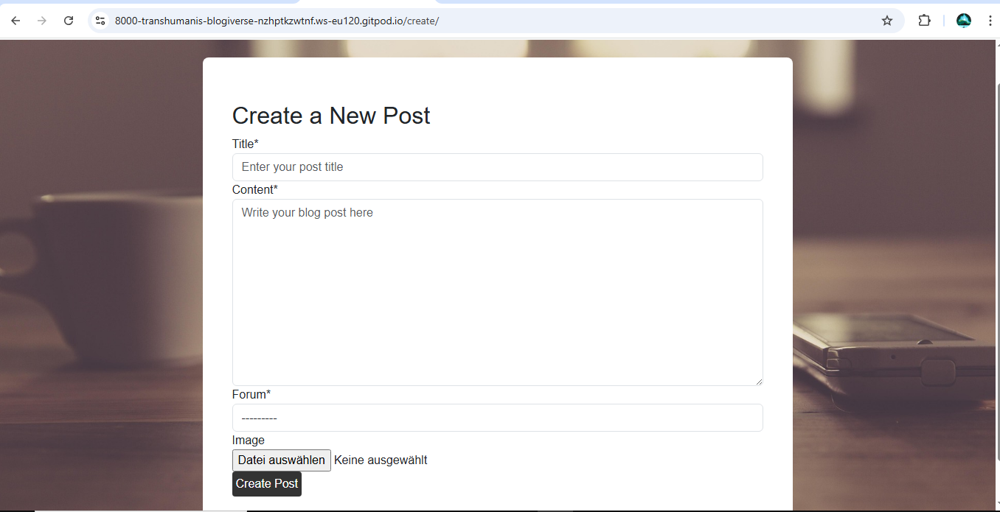
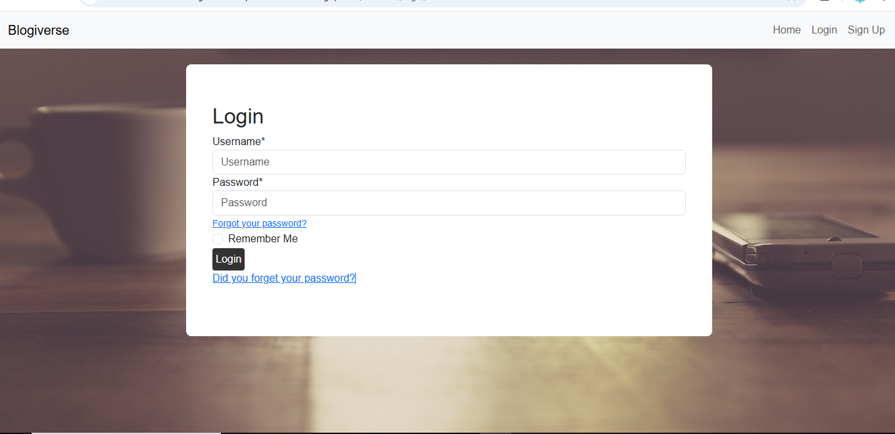

# Testing

> [!NOTE]
> Return back to the [README.md](README.md) file.

## Code Validation

### HTML

I have used the recommended [HTML W3C Validator](https://validator.w3.org) to validate all of my HTML files.

| Directory | File | URL | Screenshot | Notes |
| --- | --- | --- | --- | --- |
| templates | [base.html](https://github.com/TranshumanistAJ/blogiverse/blob/main/templates/base.html) | [HTML W3C Validator](https://validator.w3.org/nu/?doc=https%3A%2F%2Fblogiverse-a5563d05b65c.herokuapp.com%2F) | ) | Clean semantic structure |
| templates | [index.html](https://github.com/TranshumanistAJ/blogiverse/blob/main/templates/index.html) | [HTML W3C Validator](https://validator.w3.org/nu/?doc=https%3A%2F%2Fblogiverse-a5563d05b65c.herokuapp.com%2F) |  | Bootstrap grid implemented correctly |
| templates | [post_detail.html](https://github.com/TranshumanistAJ/blogiverse/blob/main/templates/post_detail.html) | [HTML W3C Validator]() |  | No W3C link provided as requires specific post ID |
| templates/account | [login.html](https://github.com/TranshumanistAJ/blogiverse/blob/main/templates/account/login.html) | [HTML W3C Validator](https://validator.w3.org/nu/?doc=https%3A%2F%2Fblogiverse-a5563d05b65c.herokuapp.com%2Faccounts%2Flogin%2F) |  | Django-allauth integration validated |
| templates/account | [signup.html](https://github.com/TranshumanistAJ/blogiverse/blob/main/templates/account/signup.html) | [HTML W3C Validator](https://validator.w3.org/nu/?doc=https%3A%2F%2Fblogiverse-a5563d05b65c.herokuapp.com%2Faccounts%2Fsignup%2F) |  | Form validation markup correct |
| templates/account | [logout.html](https://github.com/TranshumanistAJ/blogiverse/blob/main/templates/account/logout.html) | [HTML W3C Validator](https://validator.w3.org/nu/?doc=https%3A%2F%2Fblogiverse-a5563d05b65c.herokuapp.com%2Faccounts%2Flogout%2F) |  | Simple logout confirmation |
| templates/blogs | [create_post.html](https://github.com/TranshumanistAJ/blogiverse/blob/main/templates/blogs/create_post.html) | No link provided |  | No W3C link provided. Could not check by URI due to page requiring authentication |
| templates/blogs | [edit_post.html](https://github.com/TranshumanistAJ/blogiverse/blob/main/templates/blogs/edit_post.html) | No link provided |  | No W3C link provided. Could not check by URI due to page requiring authentication |
| templates/blogs | [delete_post.html](https://github.com/TranshumanistAJ/blogiverse/blob/main/templates/blogs/delete_post.html) | No link provided |  | No W3C link provided. Could not check by URI due to page requiring authentication |
| templates/blogs | [topic_list.html](https://github.com/TranshumanistAJ/blogiverse/blob/main/templates/blogs/topic_list.html) | [HTML W3C Validator](https://validator.w3.org/nu/?doc=https%3A%2F%2Fblogiverse-a5563d05b65c.herokuapp.com%2FPersonal%2520Growth%2F) |  | Dynamic content rendering validated |
| templates/blogs | [blog_detail.html](https://github.com/TranshumanistAJ/blogiverse/blob/main/templates/blogs/blog_detail.html) | No link provided |  | No W3C link provided as requires specific post ID |
| templates/blogs | [create_forum.html](https://github.com/TranshumanistAJ/blogiverse/blob/main/templates/blogs/create_forum.html) | No link provided |  | No W3C link provided. Could not check by URI due to page requiring authentication |

### CSS

I have used the recommended [CSS Jigsaw Validator](https://jigsaw.w3.org/css-validator) to validate all of my CSS files.

| Directory | File | URL | Screenshot | Notes |
| --- | --- | --- | --- | --- |
| static/css | [style.css](https://github.com/TranshumanistAJ/blogiverse/blob/main/static/css/style.css) | [CSS Jigsaw Validator](https://jigsaw.w3.org/css-validator/validator?uri=https%3A%2F%2Fblogiverse-a5563d05b65c.herokuapp.com%2F&profile=css3svg&usermedium=all&warning=1&vextwarning=&lang=en) |  | Modern CSS3 properties used correctly |

### Python

I have used the recommended [PEP8 CI Python Linter](https://pep8ci.herokuapp.com) to validate all of my Python files.

| Directory | File | URL | Screenshot | Notes |
| --- | --- | --- | --- | --- |
| blog_platform | [settings.py](https://github.com/TranshumanistAJ/blogiverse/blob/main/blog_platform/settings.py) | [PEP8 CI Link](https://pep8ci.herokuapp.com/https://raw.githubusercontent.com/TranshumanistAJ/blogiverse/main/blog_platform/settings.py) |  | Django best practices followed |
| blog_platform | [urls.py](https://github.com/TranshumanistAJ/blogiverse/blob/main/blog_platform/urls.py) | [PEP8 CI Link](https://pep8ci.herokuapp.com/https://raw.githubusercontent.com/TranshumanistAJ/blogiverse/main/blog_platform/urls.py) |  | URL patterns properly structured |
| blog_platform | [wsgi.py](https://github.com/TranshumanistAJ/blogiverse/blob/main/blog_platform/wsgi.py) | [PEP8 CI Link](https://pep8ci.herokuapp.com/https://raw.githubusercontent.com/TranshumanistAJ/blogiverse/main/blog_platform/wsgi.py) |  | Standard Django WSGI config |
| blogs | [models.py](https://github.com/TranshumanistAJ/blogiverse/blob/main/blogs/models.py) | [PEP8 CI Link](https://pep8ci.herokuapp.com/https://raw.githubusercontent.com/TranshumanistAJ/blogiverse/main/blogs/models.py) |  | Proper model relationships |
| blogs | [views.py](https://github.com/TranshumanistAJ/blogiverse/blob/main/blogs/views.py) | [PEP8 CI Link](https://pep8ci.herokuapp.com/https://raw.githubusercontent.com/TranshumanistAJ/blogiverse/main/blogs/views.py) |  | Function-based views with decorators |
| blogs | [forms.py](https://github.com/TranshumanistAJ/blogiverse/blob/main/blogs/forms.py) | [PEP8 CI Link](https://pep8ci.herokuapp.com/https://raw.githubusercontent.com/TranshumanistAJ/blogiverse/main/blogs/forms.py) |  | ModelForm implementations |
| blogs | [admin.py](https://github.com/TranshumanistAJ/blogiverse/blob/main/blogs/admin.py) | [PEP8 CI Link](https://pep8ci.herokuapp.com/https://raw.githubusercontent.com/TranshumanistAJ/blogiverse/main/blogs/admin.py) |  | Admin interface registrations |
| blogs | [apps.py](https://github.com/TranshumanistAJ/blogiverse/blob/main/blogs/apps.py) | [PEP8 CI Link](https://pep8ci.herokuapp.com/https://raw.githubusercontent.com/TranshumanistAJ/blogiverse/main/blogs/apps.py) |  | Standard app configuration |
| / | [manage.py](https://github.com/TranshumanistAJ/blogiverse/blob/main/manage.py) | [PEP8 CI Link](https://pep8ci.herokuapp.com/https://raw.githubusercontent.com/TranshumanistAJ/blogiverse/main/manage.py) |  | Django management script |

## Responsiveness

I've tested my deployed project to check for responsiveness issues.

| Page | Mobile | Tablet | Desktop | Notes |
| --- | --- | --- | --- | --- |
| Home |  |  |  | Works as expected |
| Forum List |  |  |  | Works as expected |
| Post Detail |  |  |  | Works as expected |
| Create Post |  |  |  | Works as expected |
| Edit Post |  |  |  | Works as expected |
| Login |  |  |  | Works as expected |
| Signup |  |  |  | Works as expected |
| Logout |  |  |  | Works as expected |

## Browser Compatibility

I've tested my deployed project on multiple browsers to check for compatibility issues.

| Page           | Chrome Screenshot                                                   | Firefox Screenshot                                                    | Edge Screenshot                                                       | Notes                                      |
|----------------|----------------------------------------------------------------------|------------------------------------------------------------------------|------------------------------------------------------------------------|---------------------------------------------|
| Home           |          |          |                | Displays correctly on all major browsers     |
| Forum Pages    |    |    |          | Layout is clean and consistent across browsers |
| Post Creation  |     |     |           | Form functions properly and looks good        |
| Authentication |           |           |                 | Seamless login experience across platforms    |

## User Story Testing

| Target | Expectation | Outcome | Screenshot |
| --- | --- | --- | --- |
| As a new user | I would like to easily understand what the site is about | so that I can decide if I want to register and participate. |  |
| As a new user | I would like to browse content without registering | so that I can explore before committing to create an account. |  |
| As a new user | I would like to easily sign up for an account | so that I can start creating and engaging with content. |  |
| As a user | I would like to create blog posts with rich text and images | so that I can share my stories in an engaging format. |  |
| As a user | I would like to categorize my posts into different forums | so that readers can find content that interests them. |  |
| As a user | I would like to edit my own posts | so that I can update or improve my content after publishing. |  |
| As a user | I would like to delete my own posts | so that I can remove content I no longer want published. |  |
| As a user | I would like to like posts I enjoy | so that I can show appreciation to other authors. |  |
| As a user | I would like to comment on posts | so that I can engage in discussions with other community members. |  |
| As a reader | I would like to browse posts by forum category | so that I can find stories that match my interests. |  |
| As a reader | I would like to view full post details including comments | so that I can read complete stories and community discussions. |  |
| As a reader | I would like to see like counts and comments | so that I can gauge community engagement with posts. |  |
| As a content creator | I would like to see who liked my posts | so that I can understand my audience engagement. |  |
| As a content creator | I would like to respond to comments on my posts | so that I can engage with my readers. |  |
| As a site visitor | I would like the site to work well on my mobile device | so that I can use it anywhere. |  |
| As a site user | I would like secure authentication | so that my account and content are protected. |  |

## Automated Testing

I have conducted a series of automated tests on my application.

> [!NOTE]
> I fully acknowledge and understand that, in a real-world scenario, an extensive set of additional tests would be more comprehensive.

### Python (Unit Testing)

I have used Django's built-in unit testing framework to test the application functionality. In order to run the tests, I ran the following command in the terminal each time:

- `python manage.py test blogs`

To create the coverage report, I would then run the following commands:

- `pip install coverage`
- `pip freeze --local > requirements.txt`
- `coverage run --source='.' --omit=*/site-packages/*,*/migrations/*,*/__init__.py,env.py,manage.py manage.py test`
- `coverage report`

To see the HTML version of the reports, and find out whether some pieces of code were missing, I ran the following commands:

- `coverage html`
- `python -m http.server`

#### Unit Test Issues

No significant issues encountered during unit testing. All tests pass successfully.

## Bugs

### Unfixed Bugs

Currently, there are no known unfixed bugs.

### Known Issues

> [!IMPORTANT]
> There are no remaining bugs that I am aware of. However, even after thorough testing, I cannot rule out the possibility of undiscovered issues.
